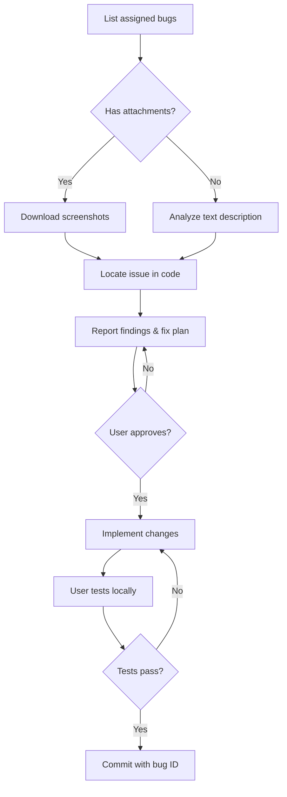

# ZenTao Bug Fix Workflow

[](https://opensource.org/licenses/MIT)
[](https://docs.anthropic.com/claude/docs)
[](https://www.zentao.net/)

> [中文文档](README.zh-CN.md)

An AI-assisted bug-fixing workflow for [Claude Code](https://claude.ai/code) that integrates with [ZenTao](https://www.zentao.net/) project management system.

## 🎯 What & Why

**Problem**: The official `zentao-cli` cannot download bug attachments (screenshots) due to session cookie authentication limitations. When bug descriptions say "see attached screenshot," AI assistants are blind.

**Solution**: This workflow combines:
- Official `zentao-cli` for querying bug data
- Third-party `zentao_mcp` for downloading attachments via REST API Token auth
- Claude Code skill that enforces a safe workflow: **analyze → report → get approval → code → test → commit**

## ✨ Features

- ✅ **Download bug screenshots** — works around official CLI limitations
- ✅ **Enforced approval gates** — AI must report findings and wait for approval before changing code
- ✅ **Auto-linked commits** — commit messages reference ZenTao bug IDs
- ✅ **Batch processing** — handle multiple bugs in sequence
- ✅ **Screenshot analysis** — Claude can see and understand visual bug reports

## 🚀 Quick Start

### Prerequisites

- Node.js 18+
- [zentao-cli](https://github.com/easysoft/zentao-cli) installed globally
- [Claude Code](https://claude.ai/code) (CLI, desktop, or web)

### Installation

```bash
# 1. Clone this repository to Claude Code's skills directory
cd ~/.claude/skills
git clone https://github.com/<your-username>/zentao-bug-fix-workflow.git
cd zentao-bug-fix-workflow

# 2. Initialize the attachment downloader submodule
git submodule update --init --recursive
cd tools/zentao-mcp
npm install
npm run build
cd ../..

# 3. Configure ZenTao credentials for zentao-cli
zentao login
# Follow prompts to enter your ZenTao URL, account, and password

# 4. Configure credentials for the attachment downloader
mkdir -p ~/.claude/config
cat > ~/.claude/config/zentao-mcp.env << EOF
ZENTAO_BASE_URL=https://your-zentao.com/zentao/api.php/v1
ZENTAO_ACCOUNT=your-username
ZENTAO_PASSWORD=your-password
ZENTAO_ALLOW_INSECURE_SSL=false
EOF
chmod 600 ~/.claude/config/zentao-mcp.env
```

### Usage

In Claude Code, trigger the skill:

```
Please process ZenTao bugs assigned to me
```

Or in Chinese:

```
处理禅道里的bug
```

Claude will:
1. List bugs assigned to you
2. For each bug:
   - Fetch details
   - Download screenshots if present
   - Analyze the issue
   - **Report findings and proposed fix** ⬅️ waits for your approval
   - Implement code changes (only after approval)
   - Wait for you to test
   - Commit with bug ID in message (only after confirmation)

## 📖 Documentation

- [Installation Guide](docs/installation.md) — detailed setup steps
- [Workflow Details](docs/workflow.md) — step-by-step process with diagram
- [Troubleshooting](docs/troubleshooting.md) — common issues and solutions
- [Architecture](docs/architecture.md) — technical design decisions

## 🔧 How It Works

### The Screenshot Download Problem

ZenTao has two authentication mechanisms:

1. **Session cookies** (used by `zentao-cli`) — work for API queries, but fail on `/file-read-N.png` endpoints (302 redirect to login page)
2. **REST API v1 Token** — works for everything including file downloads, but `zentao-cli` doesn't expose this

This project uses [dyno-nexsoft/zentao_mcp](https://github.com/dyno-nexsoft/zentao_mcp) to fill the gap.

### Workflow Diagram



## 🙏 Credits

- [zentao-cli](https://github.com/easysoft/zentao-cli) — Official ZenTao CLI by ZenTao Software
- [zentao_mcp](https://github.com/dyno-nexsoft/zentao_mcp) — MCP server with file download support (MIT)
- [Claude Code](https://claude.ai/code) — AI coding assistant by Anthropic

## 📄 License

MIT License - see [LICENSE](LICENSE) for details.

## 🤝 Contributing

Issues and PRs welcome! Please read our [Contributing Guide](CONTRIBUTING.md) first.

---

**Note**: This is an unofficial community project, not affiliated with ZenTao Software.
