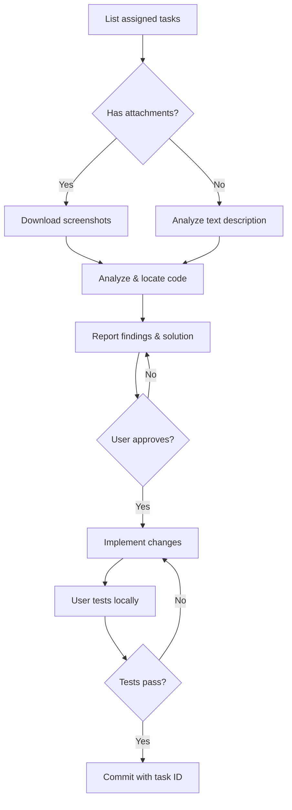

# ZenTao AI Development Workflow

[](https://opensource.org/licenses/MIT)
[](https://www.zentao.net/)

> [中文文档](README.zh-CN.md)

An AI-assisted development workflow that integrates with [ZenTao](https://www.zentao.net/) project management system. Process bugs, stories, and tasks with AI assistance while maintaining human oversight.

## 🎯 What & Why

**Problem**: The official `zentao-cli` cannot download task attachments (screenshots) due to session cookie authentication limitations. When task descriptions say "see attached screenshot," AI assistants are blind.

**Solution**: This workflow combines:
- Official `zentao-cli` for querying task data
- Third-party `zentao_mcp` for downloading attachments via REST API Token auth
- Structured workflow that enforces: **analyze → report → get approval → code → test → commit**

## ✨ Features

- ✅ **Download task screenshots** — works around official CLI limitations
- ✅ **Enforced approval gates** — AI must report findings and wait for approval before changing code
- ✅ **Multi-platform support** — Claude Code, Cursor, or any AI tool with custom prompts
- ✅ **All task types** — handles bugs, stories (features), and tasks
- ✅ **Auto-linked commits** — commit messages reference ZenTao task IDs
- ✅ **Batch processing** — handle multiple tasks in sequence
- ✅ **Screenshot analysis** — AI can see and understand visual bug reports

## 🚀 Quick Start

### Supported Platforms

Choose your AI coding assistant:

- **[Claude Code](integrations/claude-code/)** — AI-powered CLI/Desktop/Web ([Anthropic](https://claude.ai/code))
- **[Cursor](integrations/cursor/)** — AI-first code editor ([Cursor.sh](https://cursor.sh))
- **[Generic Template](integrations/prompt-template/)** — Works with GitHub Copilot, ChatGPT, Codeium, etc.

### Prerequisites

- Node.js >= 16
- [zentao-cli](https://github.com/easysoft/zentao-cli) installed globally: `npm install -g zentao-cli`
- Git
- Valid ZenTao account with task access permissions

### Installation

**Step 1: Install base dependencies**

```bash
# Install zentao-cli
npm install -g zentao-cli

# Login to ZenTao
zentao login
# Follow prompts: enter URL, account, password

# Verify
zentao my bugs
```

**Step 2: Clone this repository**

```bash
cd ~/projects  # or any directory
git clone https://github.com/huxi965/zentao-automation-flow.git
cd zentao-automation-flow
```

**Step 3: Install screenshot downloader**

```bash
# Clone zentao-mcp
cd ~/tools
git clone https://github.com/dyno-nexsoft/zentao_mcp.git
cd zentao-mcp
npm install

# Copy download script
cp ~/projects/zentao-automation-flow/tools/downloadBugImages.ts scripts/
```

**Step 4: Choose your platform and follow platform-specific setup**

- **Claude Code**: See [Claude Code Installation](integrations/claude-code/README.md)
- **Cursor**: See [Cursor Installation](integrations/cursor/README.md)
- **Other tools**: See [Generic Template Installation](integrations/prompt-template/README.md)

**Detailed instructions**: [Installation Guide](docs/installation.md)

### Usage

**Claude Code**:
```
Process ZenTao bugs from project 5
```

**Cursor** (in AI chat):
```
Process ZenTao bugs from project 5
```

**Other AI tools**: Copy the [prompt template](integrations/prompt-template/zentao-dev-prompt.md), then ask:
```
Process ZenTao bugs from project 5
```

The AI will:
1. List tasks assigned to you
2. For each task:
   - Fetch details
   - Download screenshots if present
   - Analyze the issue
   - **Report findings and proposed solution** ⬅️ waits for your approval
   - Implement code changes (only after approval)
   - Wait for you to test
   - Commit with task ID in message (only after confirmation)

## 📖 Documentation

- **[Installation Guide](docs/installation.md)** — Detailed setup for all platforms
- **[Workflow Guide](docs/workflow.md)** — Step-by-step process with diagrams
- **[Troubleshooting](docs/troubleshooting.md)** — Common issues and solutions
- **[Architecture](docs/architecture.md)** — Technical design decisions

## 🔧 How It Works

### The Screenshot Download Problem

ZenTao has two authentication mechanisms:

1. **Session cookies** (used by `zentao-cli`) — work for API queries, but fail on `/file-read-N.png` endpoints (302 redirect to login page)
2. **REST API v1 Token** — works for everything including file downloads, but `zentao-cli` doesn't expose this

This project uses [dyno-nexsoft/zentao_mcp](https://github.com/dyno-nexsoft/zentao_mcp) to fill the gap.

### Workflow Diagram



### Task Types Supported

- **Bugs (Bug)** — Fix defects, trace root causes
- **Stories (需求)** — Implement new features, build requirements
- **Tasks (任务)** — Complete assignments, handle subtasks

All task types follow the same workflow: analyze → approve → implement → test → commit.

## 🛡️ Safety Features

- **Approval gate**: AI cannot modify code without explicit user approval
- **No auto-commit**: User must test locally and confirm before committing
- **Precise staging**: Only stage specific files, never `git add .` or `git add -A`
- **Manual status updates**: AI never changes ZenTao task status (you control this)
- **Validation**: Runs type check and linting before presenting changes

## 📊 Example: Time Savings

Real-world bug fix with screenshot analysis:

| Phase | Time |
|-------|------|
| Fetch + download screenshots | ~2 min |
| Analyze screenshots | ~3 min |
| Locate code | ~3 min |
| Report + approval | ~2 min |
| Implement + validate | ~2 min |
| User testing | ~5 min |
| Commit | ~1 min |
| **Total with AI** | **~18 min** |
| Manual process | ~25 min |
| **Time saved** | **30%** |

See [full example](examples/bug-with-screenshots.md) for detailed walkthrough.

## 🙏 Credits

- [zentao-cli](https://github.com/easysoft/zentao-cli) — Official ZenTao CLI by ZenTao Software
- [zentao_mcp](https://github.com/dyno-nexsoft/zentao_mcp) — MCP server with file download support (MIT)
- [Claude Code](https://claude.ai/code) — AI coding assistant by Anthropic
- [Cursor](https://cursor.sh) — AI-first code editor

## 📄 License

MIT License - see [LICENSE](LICENSE) for details.

## 🤝 Contributing

Issues and PRs welcome! Please read our [Contributing Guide](CONTRIBUTING.md) first.

## 🌐 Community

- Report bugs: [GitHub Issues](https://github.com/huxi965/zentao-automation-flow/issues)
- Request features: [GitHub Discussions](https://github.com/huxi965/zentao-automation-flow/discussions)
- Share your experience: Add your use case in discussions!

---

**Note**: This is an unofficial community project, not affiliated with ZenTao Software, Anthropic, or Cursor.
