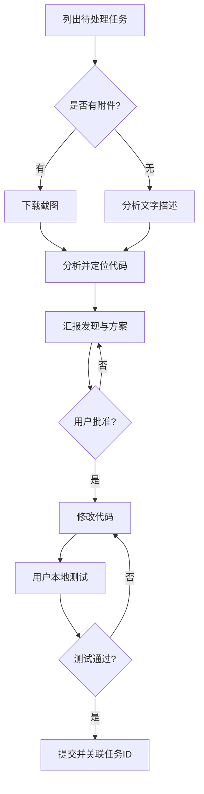

# 禅道 AI 开发工作流

[](https://opensource.org/licenses/MIT)
[](https://www.zentao.net/)

> [English Documentation](README.md)

AI 辅助的禅道开发工作流，与[禅道](https://www.zentao.net/)项目管理系统深度集成。支持 Bug 修复、需求开发、任务实现，同时保持人工监督。

## 🎯 这是什么 & 为什么需要

**问题**：禅道官方 `zentao-cli` 由于使用 session cookie 认证，无法下载任务附件（截图）。当任务描述写着"详见附图"时，AI 助手看不到图片，无法准确理解问题。

**解决方案**：本工作流组合了：
- 官方 `zentao-cli` 用于查询任务数据
- 第三方 `zentao_mcp` 用于通过 REST API Token 认证下载附件
- 结构化流程强制执行：**分析 → 汇报 → 获得批准 → 改代码 → 测试 → 提交**

## ✨ 核心特性

- ✅ **下载任务截图** — 绕过官方 CLI 限制
- ✅ **强制审批节点** — AI 必须先汇报发现和方案，获得批准后才能改代码
- ✅ **多平台支持** — Claude Code、Cursor 或任何支持自定义 Prompt 的 AI 工具
- ✅ **全任务类型** — 支持 Bug、需求（Story）、任务（Task）
- ✅ **自动关联提交** — commit message 自动引用禅道任务 ID
- ✅ **批量处理** — 按顺序处理多个任务
- ✅ **截图分析** — AI 能看懂并分析可视化的问题报告

## 🚀 快速开始

### 支持的平台

选择您的 AI 编码助手：

- **[Claude Code](integrations/claude-code/)** — AI 驱动的 CLI/桌面版/网页版（[Anthropic](https://claude.ai/code)）
- **[Cursor](integrations/cursor/)** — AI 优先的代码编辑器（[Cursor.sh](https://cursor.sh)）
- **[通用模板](integrations/prompt-template/)** — 兼容 GitHub Copilot、ChatGPT、Codeium 等

### 前置依赖

- Node.js >= 16
- [zentao-cli](https://github.com/easysoft/zentao-cli) 全局安装：`npm install -g zentao-cli`
- Git
- 有效的禅道账号及任务访问权限

### 安装步骤

**步骤 1：安装基础依赖**

```bash
# 安装 zentao-cli
npm install -g zentao-cli

# 登录禅道
zentao login
# 按提示输入：禅道地址、账号、密码

# 验证
zentao my bugs
```

**步骤 2：克隆本仓库**

```bash
cd ~/projects  # 或任意目录
git clone https://github.com/huxi965/zentao-automation-flow.git
cd zentao-automation-flow
```

**步骤 3：安装截图下载器**

```bash
# 克隆 zentao-mcp
cd ~/tools
git clone https://github.com/dyno-nexsoft/zentao_mcp.git
cd zentao-mcp
npm install

# 复制下载脚本
cp ~/projects/zentao-automation-flow/tools/downloadBugImages.ts scripts/
```

**步骤 4：选择您的平台并完成平台专用配置**

- **Claude Code**：参见 [Claude Code 安装](integrations/claude-code/README.md)
- **Cursor**：参见 [Cursor 安装](integrations/cursor/README.md)
- **其他工具**：参见 [通用模板安装](integrations/prompt-template/README.md)

**详细说明**：[安装指南](docs/installation.md)

### 使用方式

**Claude Code**：
```
处理项目 5 的禅道 Bug
```

**Cursor**（在 AI 对话中）：
```
处理项目 5 的禅道 Bug
```

**其他 AI 工具**：复制[通用模板](integrations/prompt-template/zentao-dev-prompt.md)，然后提问：
```
处理项目 5 的禅道 Bug
```

AI 会：
1. 列出指派给你的任务
2. 对每个任务：
   - 获取详情
   - 如有附件则下载截图
   - 分析问题
   - **汇报发现和解决方案** ⬅️ 等待您批准
   - 实施代码修改（仅在批准后）
   - 等待您本地测试
   - 提交代码（仅在确认后，commit message 自动关联任务 ID）

## 📖 文档

- **[安装指南](docs/installation.md)** — 所有平台的详细配置步骤
- **[工作流指南](docs/workflow.md)** — 带流程图的逐步说明
- **[常见问题](docs/troubleshooting.md)** — 问题排查与解决
- **[架构设计](docs/architecture.md)** — 技术决策与设计思路

## 🔧 工作原理

### 截图下载问题的根因

禅道同时存在两套认证机制：

1. **Session cookies**（`zentao-cli` 使用）— 查询 API 正常，但访问 `/file-read-N.png` 附件端点会被 302 重定向到登录页
2. **REST API v1 Token** — 所有端点（包括文件下载）都支持，但 `zentao-cli` 没有封装这个能力

本项目使用 [dyno-nexsoft/zentao_mcp](https://github.com/dyno-nexsoft/zentao_mcp) 补齐这块能力。

### 工作流程图



### 支持的任务类型

- **Bug（Bug）** — 修复缺陷，追溯根因
- **需求（Story）** — 实现新功能，构建需求
- **任务（Task）** — 完成分配，处理子任务

所有任务类型遵循统一流程：分析 → 批准 → 实施 → 测试 → 提交。

## 🛡️ 安全特性

- **审批节点**：AI 无法在未经明确批准的情况下修改代码
- **无自动提交**：用户必须本地测试并确认后才能提交
- **精确暂存**：只暂存特定文件，绝不使用 `git add .` 或 `git add -A`
- **手动状态更新**：AI 绝不修改禅道任务状态（由您控制）
- **验证机制**：在展示改动前运行类型检查和代码检查

## 📊 示例：节省时间

真实的带截图 Bug 修复案例：

| 阶段 | 耗时 |
|-------|------|
| 获取 + 下载截图 | ~2 分钟 |
| 分析截图 | ~3 分钟 |
| 定位代码 | ~3 分钟 |
| 汇报 + 批准 | ~2 分钟 |
| 实施 + 验证 | ~2 分钟 |
| 用户测试 | ~5 分钟 |
| 提交 | ~1 分钟 |
| **AI 辅助总计** | **~18 分钟** |
| 手动流程 | ~25 分钟 |
| **节省时间** | **30%** |

查看[完整示例](examples/bug-with-screenshots.md)了解详细过程。

## 🙏 致谢

- [zentao-cli](https://github.com/easysoft/zentao-cli) — 禅道官方 CLI，由禅道软件提供
- [zentao_mcp](https://github.com/dyno-nexsoft/zentao_mcp) — 支持文件下载的 MCP 服务器（MIT 协议）
- [Claude Code](https://claude.ai/code) — Anthropic 出品的 AI 编码助手
- [Cursor](https://cursor.sh) — AI 优先的代码编辑器

## 📄 开源协议

MIT License - 详见 [LICENSE](LICENSE) 文件。

## 🤝 贡献指南

欢迎提 Issue 和 PR！请先阅读[贡献指南](CONTRIBUTING.md)。

## 🌐 社区

- 报告问题：[GitHub Issues](https://github.com/huxi965/zentao-automation-flow/issues)
- 功能建议：[GitHub Discussions](https://github.com/huxi965/zentao-automation-flow/discussions)
- 分享经验：在 Discussions 中添加您的使用案例！

---

**注意**：本项目为非官方社区项目，与禅道软件、Anthropic 或 Cursor 无关联。
