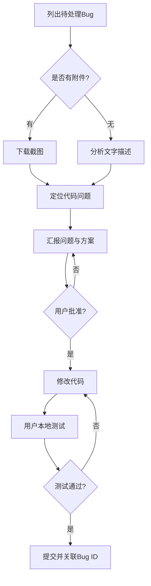

# 禅道 Bug 自动修复工作流

[](https://opensource.org/licenses/MIT)
[](https://docs.anthropic.com/claude/docs)
[](https://www.zentao.net/)

> [English Documentation](README.md)

面向 [Claude Code](https://claude.ai/code) 的 AI 辅助 Bug 修复工作流，与[禅道](https://www.zentao.net/)项目管理系统深度集成。

## 🎯 这是什么 & 为什么需要

**问题**：禅道官方 `zentao-cli` 由于使用 session cookie 认证，无法下载 Bug 附件（截图）。当 Bug 描述写着"详见附图"时，AI 助手看不到图片，无法准确理解问题。

**解决方案**：本工作流组合了：
- 官方 `zentao-cli` 用于查询 Bug 数据
- 第三方 `zentao_mcp` 用于通过 REST API Token 认证下载附件
- Claude Code skill 强制执行安全流程：**分析 → 汇报 → 获得批准 → 改代码 → 测试 → 提交**

## ✨ 核心特性

- ✅ **下载 Bug 截图** — 绕过官方 CLI 限制
- ✅ **强制审批节点** — AI 必须先汇报发现和方案，获得批准后才能改代码
- ✅ **自动关联提交** — commit message 自动引用禅道 Bug ID
- ✅ **批量处理** — 按顺序处理多个 Bug
- ✅ **截图分析** — Claude 能看懂并分析可视化的 Bug 报告

## 🚀 快速开始

### 前置依赖

- Node.js 18+
- [zentao-cli](https://github.com/easysoft/zentao-cli) 全局安装
- [Claude Code](https://claude.ai/code)（CLI、桌面版或网页版）

### 安装步骤

```bash
# 1. 克隆本仓库到 Claude Code 的 skills 目录
cd ~/.claude/skills
git clone https://github.com/<your-username>/zentao-bug-fix-workflow.git
cd zentao-bug-fix-workflow

# 2. 初始化附件下载工具子模块
git submodule update --init --recursive
cd tools/zentao-mcp
npm install
npm run build
cd ../..

# 3. 配置 zentao-cli 凭证
zentao login
# 按提示输入禅道地址、账号和密码

# 4. 配置附件下载器凭证
mkdir -p ~/.claude/config
cat > ~/.claude/config/zentao-mcp.env << EOF
ZENTAO_BASE_URL=https://your-zentao.com/zentao/api.php/v1
ZENTAO_ACCOUNT=your-username
ZENTAO_PASSWORD=your-password
ZENTAO_ALLOW_INSECURE_SSL=false
EOF
chmod 600 ~/.claude/config/zentao-mcp.env
```

### 使用方式

在 Claude Code 中触发 skill：

```
处理禅道里的bug
```

或：

```
修复禅道里指派给我的 Bug
```

Claude 会：
1. 列出指派给你的 Bug
2. 对每个 Bug：
   - 获取详情
   - 如有附件则下载截图
   - 分析问题
   - **汇报发现和修复方案** ⬅️ 等待您批准
   - 实施代码修改（仅在批准后）
   - 等待您本地测试
   - 提交代码（仅在确认后，commit message 自动关联 Bug ID）

## 📖 文档

- [安装指南](docs/installation.md) — 详细安装配置步骤
- [工作流详解](docs/workflow.md) — 带流程图的逐步说明
- [常见问题](docs/troubleshooting.md) — 问题排查与解决
- [架构设计](docs/architecture.md) — 技术决策与设计思路

## 🔧 工作原理

### 截图下载问题的根因

禅道同时存在两套认证机制：

1. **Session cookies**（`zentao-cli` 使用）— 查询 API 正常，但访问 `/file-read-N.png` 附件端点会被 302 重定向到登录页
2. **REST API v1 Token** — 所有端点（包括文件下载）都支持，但 `zentao-cli` 没有封装这个能力

本项目使用 [dyno-nexsoft/zentao_mcp](https://github.com/dyno-nexsoft/zentao_mcp) 补齐这块能力。

### 工作流程图



## 🙏 致谢

- [zentao-cli](https://github.com/easysoft/zentao-cli) — 禅道官方 CLI，由禅道软件提供
- [zentao_mcp](https://github.com/dyno-nexsoft/zentao_mcp) — 支持文件下载的 MCP 服务器（MIT 协议）
- [Claude Code](https://claude.ai/code) — Anthropic 出品的 AI 编码助手

## 📄 开源协议

MIT License - 详见 [LICENSE](LICENSE) 文件。

## 🤝 贡献指南

欢迎提 Issue 和 PR！请先阅读[贡献指南](CONTRIBUTING.md)。

---

**注意**：本项目为非官方社区项目，与禅道软件公司无关联。
