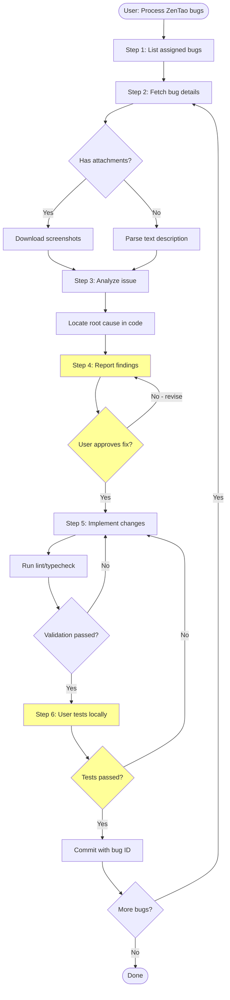

# Workflow Details

Complete walkthrough of the bug-fixing workflow with decision trees and examples.

## Overview

The workflow enforces a structured approach to bug fixing:

```
List → Fetch → Analyze → Report → Approve → Implement → Test → Commit
```

Each step has specific responsibilities and checkpoints to prevent premature code changes or untested commits.

## Workflow Diagram



Yellow boxes represent **human approval gates** where the workflow pauses for user input.

## Step-by-Step Breakdown

### Step 1: List Assigned Bugs

**Goal**: Identify bugs to process

**Actions**:
```bash
# Reliable approach: query by project and filter by assignedTo
zentao bug --project=<projectID> --pick=id,title,status,assignedTo --format=json

# Alternative if your ZenTao supports it:
zentao my bugs --pick=id,title,status --format=json
```

**AI Behavior**:
- Present list to user
- Ask which bugs to process (all, specific IDs, by priority)
- Confirm processing order (usually sequential by ID)

**Decision Points**:
- No bugs assigned? → End workflow, report "No bugs to process"
- Multiple bugs? → Process one at a time, not in parallel

### Step 2: Fetch Bug Details

**Goal**: Get full bug information including description and attachments

**Actions**:
```bash
zentao bug <id> --format=json
```

**Key Fields**:
- `title`: Bug summary
- `steps`: Reproduction steps (often contains embedded `` references)
- `status`: Current state (active, resolved, closed)
- `assignedTo`: Who owns it
- `openedBy`: Reporter
- `product`, `project`: Context

**Decision Tree**:

```
Parse `steps` field
├─ Contains "file-read-N.png" references?
│  ├─ Yes → Flag as "has attachments"
│  └─ No → Check if description is meaningful
│     ├─ Description is clear → Flag as "text-only"
│     └─ Description is vague/empty → Warn user, ask if they want to skip
└─ Proceed to Step 3
```

### Step 3: Analyze the Issue

**For Bugs with Attachments**:

```bash
cd ~/.claude/tools/zentao-mcp
npx tsx scripts/downloadBugImages.ts <bugId> --out ./zentao-bug-images
```

- Each bug gets a `#<bugId>/` subdirectory
- Screenshots saved as `file-read-123.png`, `file-read-456.png`, etc.
- Use Claude's image reading capability to view screenshots
- Extract annotations, highlighted areas, or visual discrepancies

**For Text-Only Bugs**:

- Parse `steps` field directly
- Identify: expected behavior vs. actual behavior
- Look for: specific inputs, screenshots, error messages

**Root Cause Analysis**:

1. **Understand the symptom** (what user sees)
2. **Trace to source** (which component/API/data flow)
3. **Identify the defect** (wrong logic, missing validation, incorrect data mapping)

**Example**:

> **Bug #42**: Field "Patient Age" shows "undefined" in statistics page
> 
> **Analysis**:
> - Symptom: UI displays "undefined" instead of numeric age
> - Trace: Statistics page → `PatientStatsCard` component → `patient.age` prop
> - Root cause: Backend `/api/stats` returns `null` for age when patient has no birthdate, frontend doesn't handle null

### Step 4: Report Findings and Fix Plan

**Goal**: Get user approval before changing code

**Report Template**:

```markdown
## Bug #<id>: <title>

### Problem
<Explain in your own words what's wrong>

### Root Cause
<Which file(s), which logic, why it's failing>

### Proposed Fix
<Specific changes you'll make>

**Files to modify**:
- `path/to/file1.ts:123` — <what will change>
- `path/to/file2.tsx:45` — <what will change>

**Alternative approaches** (if applicable):
1. <Option A>
2. <Option B>

Which approach do you prefer?
```

**AI Behavior**:
- Stop and wait for user response
- Do NOT proceed to code changes without explicit approval
- If user says "revise," ask what to change and re-report

**Approval Phrases** (proceed to Step 5):
- "Approved"
- "Go ahead"
- "Looks good"
- "Fix it"

**Rejection Phrases** (revise report):
- "Wait"
- "Not that way"
- "Try option B instead"
- "Let me think"

### Step 5: Implement Code Changes

**Goal**: Apply approved fix

**Best Practices**:
- Change only what's in scope for this bug
- Don't refactor unrelated code
- Don't clean up other uncommitted changes in the working directory
- Add comments only for non-obvious logic
- Match existing code style

**After Editing**:

```bash
# Run project's lint/typecheck
npx tsc --noEmit  # TypeScript projects
npx eslint <changed-file>  # If project uses ESLint
```

**Report to User**:
```
Changes implemented:
- Modified `path/to/file.ts:123-145`
- Added null check for `patient.age`
- Typecheck passed ✓
- ESLint passed ✓

Ready for your local testing.
```

**If Validation Fails**:
- Fix errors immediately
- Don't ask user to fix lint errors you introduced
- Re-run validation after fixing

### Step 6: User Testing and Commit

**Goal**: Verify fix works in real environment, then commit

**AI Behavior**:
- Explicitly state: "Please test locally"
- List what to test (happy path + edge cases you fixed)
- Wait for user confirmation

**User Tests**:
- Start dev server
- Navigate to affected page/feature
- Verify fix works
- Check for regressions

**After User Confirms "Tests Passed"**:

```bash
# Stage only files changed for this bug
git add path/to/file1.ts path/to/file2.tsx

# Commit with standardized message
git commit -m "禅道Bug #42: Fix undefined patient age in statistics

禅道 Bug #42: https://zentao.example.com/zentao/bug-view-42.html"

# Push to remote
git push origin <current-branch>
```

**Commit Message Format**:
- **Title**: `禅道Bug #<id>: <concise fix description>`
- **Body**: `禅道 Bug #<id>: <ZenTao URL>`

**What NOT to Do**:
- Don't commit without user confirmation
- Don't use `git add -A` or `git add .` (may include unrelated changes)
- Don't update bug status in ZenTao (user does this manually)

## Batch Processing

When processing multiple bugs:

1. Complete entire workflow for Bug A (through commit)
2. Then start workflow for Bug B
3. Don't interleave steps (e.g., don't analyze all bugs then code all bugs)

**Reason**: Each bug may require user approval; parallelizing creates confusion about which approval applies to which bug.

## Error Recovery

### Download Failed (0-byte screenshots)

**Cause**: File ID mismatch or network issue

**Recovery**:
1. Check `steps` field for actual `file-read-N.png` references
2. Retry download once
3. If still fails, ask user if bug description has alternate details
4. Proceed with text-only analysis if possible

### User Rejects Fix Multiple Times

**Recovery**:
1. After 2 rejections, ask user to clarify requirements
2. Offer to pause this bug and move to next one
3. Don't loop indefinitely

### Tests Fail After Implementation

**Recovery**:
1. Ask user for specific failure details
2. Revise code based on feedback
3. Re-run validation
4. Re-submit for testing

## Best Practices

### For AI Agents

- **Be patient**: Wait for approval at each gate
- **Be precise**: Specify file:line in reports
- **Be honest**: If you can't verify something (e.g., UI appearance), say so
- **Be thorough**: Check both happy path and edge cases

### For Users

- **Review reports carefully**: AI's root cause analysis may be wrong
- **Test thoroughly**: AI can't see browser UI; you must verify
- **Provide feedback**: If fix is wrong, explain what's missing
- **Batch similar bugs**: Process all "null check" bugs together for efficiency

## Next Steps

- See [Troubleshooting](troubleshooting.md) for common issues
- See [Architecture](architecture.md) for technical design decisions
- Try the workflow: "Process ZenTao bug #42"
